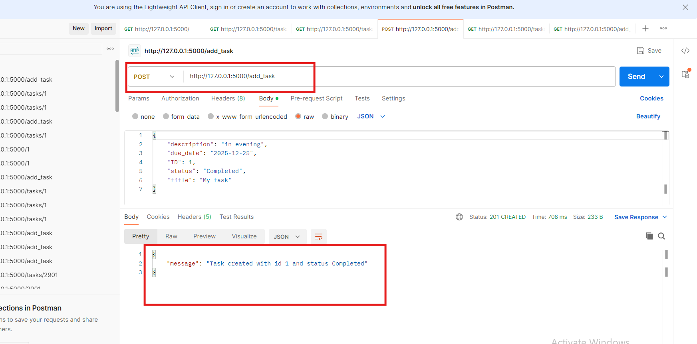
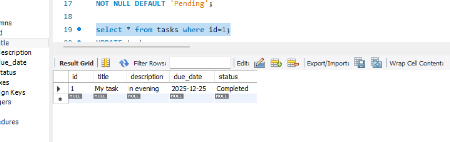
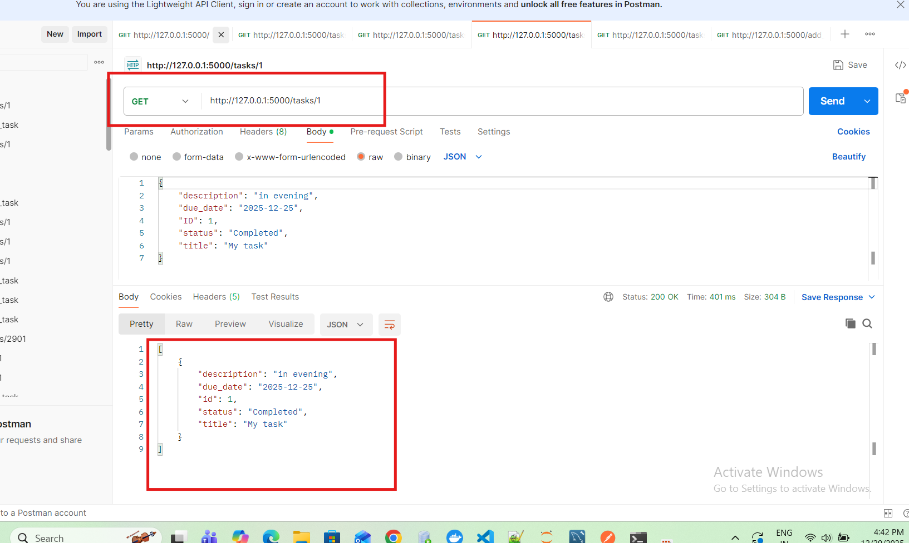
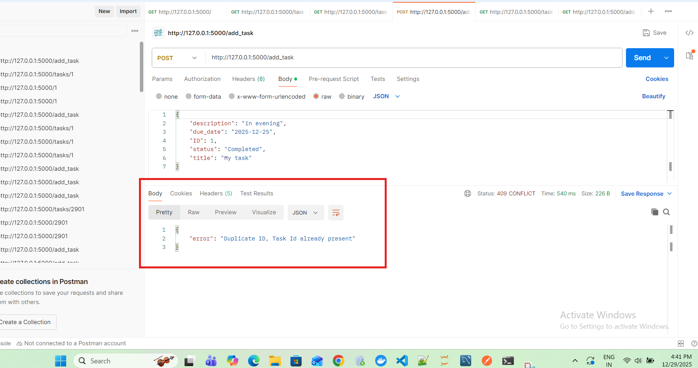

A **Flask-based To-Do** application that manages:
- Adding new tasks in TO-DO list
- Checking (All/ Completed/ Pending/ Overdue) tasks from TO-DO list
- Modifying existing tasks in TO-DO list
- Deleting existing tasks from TO-DO list

**Tech Stack**:
- Backend: Flask (Python)
- Database: MySQL
- Testing: pytest

**Steps for Project Setup**-

Step 1-Clone git repository:

git clone https://github.com/abhinav7876/To_Do_List_Flask.git

Step 2- Create virtual environment:

conda create -p venv python==3.11 -y

Step 3- Activate virtual environment:

conda activate venv/

Step 4- Install requirements in virtual environment:

pip install -r requirements.txt

Step 5- Database Setup

Run the following sql queries in MySQL app:

- CREATE DATABASE todo_db;

- USE todo_db;

- CREATE TABLE tasks (
        id INT PRIMARY KEY,
        title VARCHAR(250) NOT NULL,
        description VARCHAR(250),
        due_date DATE,
        status VARCHAR(50) NOT NULL DEFAULT 'Pending'
    );

Step 6- Rename dummy_env to .env file

Step 7- Update DB password in .env file

Step 8-Launch the app:

python app.py

Step 9- Open up localhost

http://127.0.0.1:5000/

**Testing**

Total **22 test cases** for different API endpoints are integrated for testing in this TO-Do Application

STEPS- Run the following command:

- pytest -v

------------------------------------------------------------------------------------------------------------------

Alternatively check in Postman with below json request format: 
- Request Body (JSON)

{

    "description": "in evening",

    "due_date": "2025-12-25",

    "ID": 1,

    "status": "Completed",

    "title": "My task"

}

---------------------------------------------------------------------------------------------------------------------------

**API Endpoints Description**:

| Method | Endpoint            | Description |
|------|--------------------|------------|
| GET | `/` | Loads home page |
| GET | `/tasks` | Fetch all tasks |
| GET | `/tasks/{id}` | Fetch task with id |
| GET | `/tasks/completed` | Fetch all completed tasks |
| GET | `/tasks/pending` | Fetch all pending tasks (includes overdue tasks) |
| GET | `/tasks/overdue` | Fetch all overdue tasks |
| POST | `/add_task` | Create new task (with proper validations) |
| PUT | `/tasks/{id}` | Update existing task |
| DELETE | `/tasks/{id}` | Delete existing task |

----------------------------------------------------------------------------------------------------------------------------
**Data validations added in all above API endpoints**.

- Task ID must be unique
- Title is mandatory
- Due date must be in YYYY-MM-DD format
- Status must be one of: Pending, Completed, Overdue
- Invalid or missing fields return proper error messages
- Due date cannot be in the past if status is Pending
- When updating a task, if the due date is in the past and status is not Completed, status is automatically updated to Overdue
- Task ID in URL and request body must match during update
- Fetching, updating, or deleting a task that does not exist in db returns 404 Not Found error
- Handles duplicate entry in task creation
- Logged all important events, validation failures, and errors
- All necessary data validations while creating, updating and deleting tasks are handled with proper error codes

-----------------------------------------------------------------------------------------------------------------------------------
Example 1 : **Creating new task**
Method: POST  
API ENDPOINT: http://127.0.0.1:5000/add_task

- Request Body (JSON)-

{

    "description": "in evening",

    "due_date": "2025-12-25",

    "ID": 1,

    "status": "Completed",

    "title": "My task"

}

- Response from API-

{

    "message": "Task created with id 1 and status Completed"

}

Error code:201 [CREATED]
Automatically record will get store in 'tasks' table in MySQL db

----------------------------------------
Check above created task id:
Method: GET  
API ENDPOINT: http://127.0.0.1:5000/tasks/1

- Response from API-

[
    {

    "description": "in evening",

    "due_date": "2025-12-25",

    "ID": 1,

    "status": "Completed",

    "title": "My task"

}
]

Error code:200 [OK]

----------------------------------------------------------------------------------------------------------------------------------

Example 2 : **Trying creating duplicate task id**
Method: POST  
API ENDPOINT: http://127.0.0.1:5000/add_task

- Request Body-

{

    "description": "in evening",

    "due_date": "2025-12-25",

    "ID": 1,

    "status": "Completed",

    "title": "My task"

}

- Response from API containing error message-

{

    "error": "Duplicate ID, Task Id already present"

}

Error code:409 [CONFLICT]

